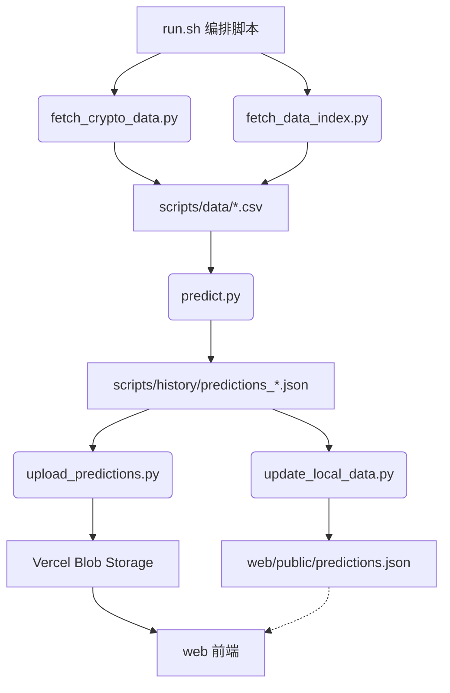

# k-online

在线K线预测系统

## 项目简介

k-online 是一个在线K线预测系统。它通过自动化流程获取市场数据（加密货币 + A股指数），运用 Kronos 预测模型进行分析，并将预测结果上传至 Vercel Blob 存储。前端 Web 界面加载预测数据进行交互式展示。

## 系统架构

### 核心模块

| 模块 | 说明 |
|------|------|
| `model/` | Kronos 模型定义（分词器、模型、预测器、图表数据生成） |
| `scripts/` | 数据获取 & 预测流水线 |
| `web/` | React + TypeScript 前端应用 |
| `examples/` | Kronos 模型使用示例及模型缓存 |

### 工作流程



### Scripts 数据流

1. **数据获取**: `fetch_crypto_data.py` / `fetch_data_index.py` 分别从 Binance 和 AkShare 拉取 K 线数据，存为 CSV
2. **模型预测**: `predict.py` 加载数据，调用 `CryptoPredictor` / `IndexPredictor` 生成预测，写入 `history/` 目录
3. **数据合并**: `prediction_merger.py` 提供共享的"查找最新文件 + 合并"逻辑
4. **本地更新**: `update_local_data.py` 合并最新预测到 `web/public/predictions.json`（开发用）
5. **线上上传**: `upload_predictions.py` 合并最新预测并上传到 Vercel Blob（生产用）

### 前端架构

- **框架**: React 18 + TypeScript + Vite 5
- **状态管理**: Zustand
- **图表**: ECharts (echarts-for-react)
- **样式**: Tailwind CSS
- **部署**: Vercel（Serverless API + 静态资源）
- **API**: `web/api/get-latest-prediction-url.ts` 从 Blob 获取最新预测数据 URL

## 模块说明

### `scripts/` 目录

| 文件 | 职责 |
|------|------|
| `run.sh` | 主编排脚本，支持 `-m` 市场类型、`-i` 间隔、`-u` 上传、`-p` 预测模式等选项 |
| `data_fetcher.py` | 数据获取基类（抽象） |
| `crypto_fetcher.py` | 加密货币数据获取（Binance API） |
| `index_fetcher.py` | A股指数数据获取（AkShare） |
| `fetch_crypto_data.py` | 加密货币数据获取入口 |
| `fetch_data_index.py` | A股指数数据获取入口 |
| `market_predictor.py` | 市场预测器基类（模型加载、回测、预测） |
| `crypto_predictor.py` | 加密货币预测器 |
| `index_predictor.py` | A股指数预测器 |
| `predict.py` | 预测主程序 |
| `prediction_merger.py` | 预测数据合并工具（共享逻辑） |
| `update_local_data.py` | 更新本地前端数据 |
| `upload_predictions.py` | 上传预测到 Vercel Blob |

### `web/` 目录

| 目录/文件 | 说明 |
|-----------|------|
| `src/components/` | React 组件（Dashboard、ChartDisplay、StockSelector 等） |
| `src/hooks/` | 自定义 Hook（usePredictions） |
| `src/services/` | API 服务层 |
| `src/store/` | Zustand 状态管理 |
| `src/types/` | TypeScript 类型定义 |
| `src/utils/` | 工具函数 |
| `api/` | Vercel Serverless Functions |
| `public/predictions.json` | 本地/开发用预测数据 |

## 安装与运行

### 环境准备

1. **Python 环境**: Python 3.12+
2. **Node.js**: Node 18+
3. **虚拟环境** (使用 `uv` 管理):
    ```bash
    source .venv/bin/activate
    ```

### 依赖安装

```bash
# Python 依赖
uv pip install -r requirements.txt

# 前端依赖
cd web && npm install
```

### 运行预测流水线

```bash
cd scripts

# 回测所有市场（默认模式）
bash run.sh -m all

# 预测所有市场未来走势
bash run.sh -m all -p

# 预测并上传到 Vercel Blob
bash run.sh -m all -p -u

# 仅加密货币
bash run.sh -m crypto -i 1h

# 仅A股指数
bash run.sh -m index -i 15

# 使用现有数据重新预测
bash run.sh -m all -s -p

# 仅上传已有预测结果
bash run.sh -U
```

### 启动前端开发服务器

```bash
cd web
npm run dev
```

开发环境下 API 请求会被 Vite 代理拦截，返回本地 `predictions.json`。

### 构建与部署

前端部署在 Vercel 上，通过 `web/api/get-latest-prediction-url.ts` Serverless Function 从 Blob 获取最新数据 URL。

```bash
cd web
npm run build
```

## 联系方式

昵称: kuhung
邮箱: hi@kuhung.me
时间: 2026年

## 许可证

本项目采用 MIT 许可证。详见 `LICENSE` 文件。
