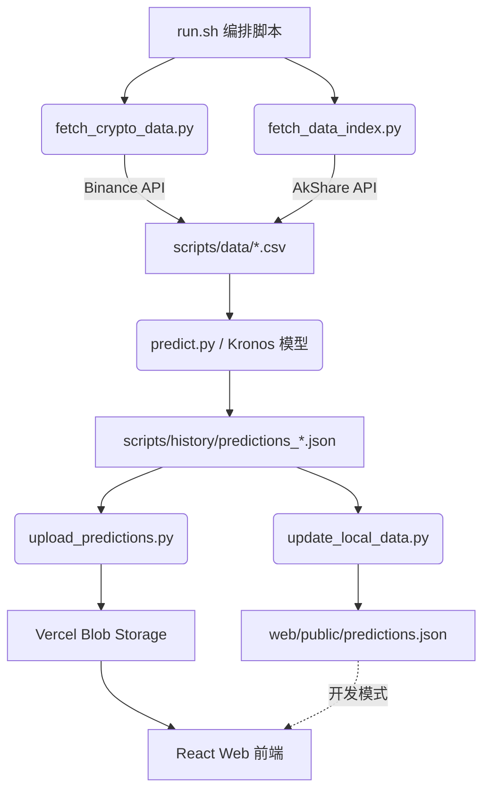

# k-online — AI 驱动的金融时序预测系统

<div align="center">

[](LICENSE)
[](https://www.python.org/)
[](https://react.dev/)
[](https://vercel.com/)
[](.github/workflows/predict.yml)

**基于 Kronos 时序大模型的 OHLCV K 线预测平台，支持加密货币与 A 股指数，每日自动预测并推送结果。**

[在线 Demo](https://k.kuhung.me) · [快速开始](#快速开始) · [示例代码](examples/) · [贡献指南](CONTRIBUTING.md)

</div>

---

## 目录

- [项目简介](#项目简介)
- [功能特性](#功能特性)
- [系统架构](#系统架构)
- [快速开始](#快速开始)
- [配置说明](#配置说明)
- [自动化部署](#自动化部署)
- [模块文档](#模块文档)
- [贡献指南](#贡献指南)
- [联系方式](#联系方式)
- [许可证](#许可证)

---

## 项目简介

**k-online** 是一个开源的金融时序预测平台，将 [Kronos](https://huggingface.co/Kronos-Forecasting) 预训练时序大模型与自动化数据管道结合，提供面向加密货币（BTC/ETH 等）及 A 股指数的每日 K 线预测服务。

**核心价值：**

- 零训练成本：直接加载 Hugging Face 上的 Kronos 预训练权重推理
- 全自动化：GitHub Actions 每日定时执行预测 → 写入 Vercel Blob → 前端实时展示
- 开箱即用：提供完整的数据抓取、预测、前端展示一体化解决方案
- 可扩展：支持自定义数据源与标的，可横向扩展到任意 OHLCV 数据

---

## 功能特性

| 特性 | 说明 |
|------|------|
| 多市场支持 | 加密货币（Binance）+ A 股指数（AkShare） |
| 时序大模型 | Kronos 预训练模型，支持含/不含成交量的 OHLCV 预测 |
| 每日自动化 | GitHub Actions 每天 UTC 0:00 自动预测并更新 |
| 云端存储 | 预测结果上传至 Vercel Blob，全球 CDN 加速 |
| 可视化前端 | React + ECharts K 线图表，交互式展示预测结果 |
| 回测支持 | 内置历史回测，评估涨跌方向准确率与波动放大概率 |
| 响应式设计 | 前端支持桌面与移动端自适应布局 |

---

## 系统架构

### 数据流



### 技术栈

| 层级 | 技术选型 |
|------|---------|
| 预测模型 | [Kronos](https://huggingface.co/Kronos-Forecasting)（PyTorch + Hugging Face Hub） |
| 数据源 | Binance API、AkShare、yfinance |
| 存储 | Vercel Blob |
| 前端 | React 18、TypeScript、Vite 5、Tailwind CSS、ECharts |
| 状态管理 | Zustand |
| API | Vercel Serverless Functions |
| CI/CD | GitHub Actions |
| 许可证 | MIT |

---

## 快速开始

### 环境要求

- Python 3.10+
- Node.js 18+
- `uv`（Python 包管理器）

### 1. 克隆仓库

```bash
git clone https://github.com/kuhung/k-online.git
cd k-online
```

### 2. 安装 Python 依赖

```bash
# 创建并激活虚拟环境
uv venv
source .venv/bin/activate

# 安装依赖
uv pip install -r requirements.txt
```

### 3. 运行预测示例

```bash
cd examples

# 含成交量特征的预测
python prediction_example.py

# 仅价格特征的预测
python prediction_wo_vol_example.py
```

### 4. 运行完整预测流水线

```bash
cd scripts

# 预测所有市场并上传到 Vercel Blob
bash run.sh -m all -p -u

# 仅回测（不上传）
bash run.sh -m all

# 仅加密货币预测（1小时级别）
bash run.sh -m crypto -i 1h -p

# 仅 A 股指数预测（15分钟级别）
bash run.sh -m index -i 15 -p

# 使用现有数据重新预测（跳过数据抓取）
bash run.sh -m all -s -p

# 仅上传已有预测结果
bash run.sh -U
```

### 5. 启动前端

```bash
cd web
npm install
npm run dev
```

开发环境访问 [http://localhost:3000](http://localhost:3000)。API 请求由 Vite 代理拦截，自动读取本地 `web/public/predictions.json`。

---

## 配置说明

### 环境变量

在项目根目录创建 `.env` 文件（参考以下说明）：

| 变量 | 必填 | 说明 |
|------|------|------|
| `BLOB_READ_WRITE_TOKEN` | 是（生产） | Vercel Blob 读写 Token |
| `BINANCE_TLD` | 否 | Binance 域名后缀，美区填 `us`（默认 `com`） |
| `HTTP_PROXY` | 否 | HTTP 代理地址 |
| `HTTPS_PROXY` | 否 | HTTPS 代理地址 |

### Hugging Face 模型缓存

模型默认缓存至 `examples/my_kronos_cache/`，首次运行会自动从 Hugging Face Hub 下载。

---

## 自动化部署

### GitHub Actions

`.github/workflows/predict.yml` 已配置每日定时任务：

1. 每天 UTC 00:00 自动触发（可手动触发）
2. 抓取最新市场数据
3. 调用 Kronos 模型生成预测
4. 上传结果至 Vercel Blob
5. 将 `web/public/predictions.json` 变更提交回仓库

**所需 Secrets（在仓库 Settings → Secrets 中配置）：**

| Secret | 说明 |
|--------|------|
| `BLOB_READ_WRITE_TOKEN` | Vercel Blob 访问令牌 |
| `BINANCE_TLD` | （可选）Binance 域名后缀 |
| `HTTP_PROXY` / `HTTPS_PROXY` | （可选）代理配置 |

### Vercel 部署前端

```bash
cd web
npm run build
# 将 dist/ 部署至 Vercel，或通过 Vercel CLI / GitHub 集成自动部署
```

前端通过 `web/api/get-latest-prediction-url.ts` Serverless Function 从 Blob 拉取最新预测数据。

---

## 模块文档

### `model/` — Kronos 模型

| 文件 | 说明 |
|------|------|
| `kronos.py` | `KronosTokenizer`（BSQ 量化分词器）、`Kronos`（预测模型）、`KronosPredictor`（推理封装） |
| `chart_data_generator.py` | 生成前端图表所需的结构化数据 |
| `module.py` | Transformer 基础模块（Attention、FFN 等） |

### `scripts/` — 数据与预测流水线

| 文件 | 职责 |
|------|------|
| `run.sh` | 主编排脚本，支持 `-m`（市场）、`-i`（间隔）、`-p`（预测）、`-u`（上传）、`-s`（跳过抓取）等选项 |
| `data_fetcher.py` | 数据获取抽象基类 |
| `crypto_fetcher.py` | 加密货币数据获取（Binance API） |
| `index_fetcher.py` | A 股指数数据获取（AkShare） |
| `fetch_crypto_data.py` | 加密货币数据获取入口 |
| `fetch_data_index.py` | A 股指数数据获取入口 |
| `market_predictor.py` | 市场预测器抽象基类（模型加载、回测、预测） |
| `crypto_predictor.py` | 加密货币专用预测器 |
| `index_predictor.py` | A 股指数专用预测器 |
| `predict.py` | 预测主程序 |
| `prediction_merger.py` | 预测数据合并工具 |
| `update_local_data.py` | 更新本地前端数据（开发用） |
| `upload_predictions.py` | 上传预测至 Vercel Blob（生产用） |

### `web/` — React 前端

详见 [web/README.md](web/README.md)。

### `examples/` — 使用示例

详见 [examples/README.md](examples/README.md)。

---

## 贡献指南

欢迎 Issue、PR 和讨论！详见 [CONTRIBUTING.md](CONTRIBUTING.md)。

---

## 联系方式

- 昵称：kuhung
- 邮箱：hi@kuhung.me

---

## 许可证

本项目采用 [MIT License](LICENSE) 开源。
